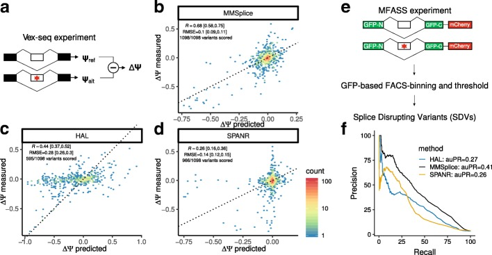
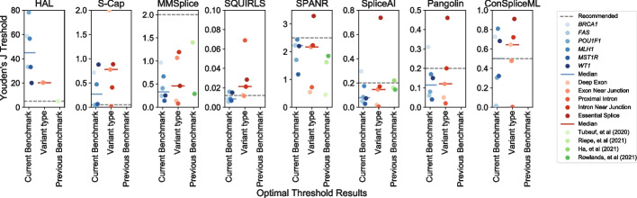
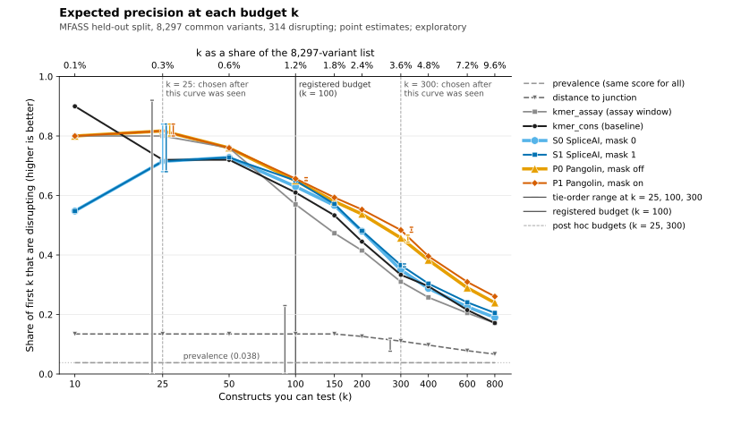

You can run a fixed number of minigene splicing experiments on a list of human SNVs, and you need a score to rank the list. The candidates are a supervised baseline trained on assay labels and two zero-shot splice specialists, [SpliceAI](https://doi.org/10.1016/j.cell.2018.12.015) and [Pangolin](https://pmc.ncbi.nlm.nih.gov/articles/PMC9022248/), each with masking off and on. On 8,297 held-out variants from the MFASS assay (314 disrupting), the historical baseline `kmer_cons`, the published MFASS-v2 model with its published settings, put 61 disrupting variants in its first 100. SpliceAI put 63 (unmasked) or 65 (masked), and Pangolin 65 (unmasked) or 65 to 66 (masked, tie-dependent). No difference at 100 was established: for unmasked Pangolin the paired difference is +0.040 [−0.038, +0.120], and across the four configurations the intervals allow about 7 fewer to 13 more disruptions per 100.

Every interval is exploratory and unadjusted for multiple comparisons, because the held-out outcomes had been inspected in earlier work. Pangolin's whole-list average precision and AUROC were higher than the baseline's, and at a budget of 300, chosen after the point estimates had been seen, its difference interval excludes zero: a lead to test, not a finding. The endpoint is exon recognition in a synthetic reporter, not patient splicing or pathogenicity. The specialist rows are a saved-score replay: published per-variant predictions from an [annotation-matched study](https://github.com/rewire-bio/rewire-benchmarks/blob/093fd1ae198c80ce34408d84d6543bca4fc538f2/benchmarks/mfass/results/matched-annotation-v1/README.md), re-evaluated here without rerunning either tool. Code: [splice-shortlist.zip](../downloads/splice-shortlist.zip).

Disclosure: the matched study, exclusions analysis and companion code come from this site's benchmark project, [rewire-benchmarks](https://github.com/rewire-bio/rewire-benchmarks/tree/093fd1ae198c80ce34408d84d6543bca4fc538f2/benchmarks/mfass) (`093fd1a`). An AI coding agent (Claude) ran the companion commands, and this article was drafted with the same model. The study had an [automated Claude review](https://github.com/rewire-bio/rewire-benchmarks/blob/093fd1ae198c80ce34408d84d6543bca4fc538f2/benchmarks/mfass/results/matched-annotation-v1/reviews/claude-scientific-review.md); none of this work has had independent human scientific review.

**At a glance.** Rows assume an MFASS-like minigene endpoint and summarise "Which configuration to use, by situation". "Same-design labels" are assay labels from the same construct design. The validation-selected baseline, `kmer_cons_selected`, is `kmer_cons` with hyperparameters chosen on held-aside training groups instead of the published ones. P@k is the fraction of the first k ranked variants that disrupt splicing.

| Situation | Where to start | What the evidence shows | Main caveat |
|---|---|---|---|
| Same-design labels; about 1.2% of the list (tested at 100) | Either baseline or any specialist; choose on cost and coverage (Table 2) | No P@100 interval excludes zero, against either baseline (Tables 3 and 4) | Not equivalence: against either baseline, about 9 fewer to 13 more disruptions per 100 remain possible |
| No assay labels; about 1.2% of the list (tested at 100) | A specialist, after GRCh38 allele, strand and transcript checks; choose on runtime, downloads and licence (Table 2; licences under "Limits and failure cases") | The distance rule finds about 13 per 100, the specialists 63 to 66 (Table 2); the study's three specialist contrasts established no top-100 difference | Distance against the specialists was not tested; `P0` − `S0` allows about 3 fewer to 8 more per 100 |
| Same-design labels; about 3.6% of the list (tested at 300, post hoc) | Pilot Pangolin (`P0` or `P1`) | Both Pangolin P@300 intervals exclude zero against the historical baseline (Table 3; bands in Table 6) | Post hoc budget; the validation-selected baseline was not tested at 300 |
| Same-design labels; about 0.3% of the list (tested at 25, post hoc) | Fix the tie rule before testing | No measured interval excludes zero (Table 3); ties move SpliceAI by up to 4 of 25 and hyperparameters move the baseline by 3 (Table 5) | Post hoc budget; point estimates are fragile |
| No labels at any fraction other than about 1.2%; labels at any fraction other than about 0.3%, 1.2% or 3.6% | Pilot before committing; without labels, start with a specialist | Point estimates only (Figure 4); without labels, `P0` had higher AP and AUROC than `S0` in the matched study (exploratory) | No P@k contrast was tested at these fractions |

*Where to start, by budget and label availability. Budgets are fractions of this one list of 8,297 variants, not thresholds for other lists. Figure 6 draws the same routes as a flowchart.*

## The decision is how many disrupting variants land in your first k

[MFASS](https://pmc.ncbi.nlm.nih.gov/articles/PMC6599603/) (Chong et al., *Molecular Cell*, 2019) places each variant in a 170 bp construct, a natural exon under 100 bp with at least 40 bp of upstream and 30 bp of downstream intron, inside a three-exon minigene reporter integrated once per HEK293T cell; sorting cells by fluorescence gives an exon inclusion index. A splice-disrupting variant lowers the index by at least 0.5 in an exon whose wild-type index is at least 0.5. Of 27,733 ExAC variants, 1,050 (3.8%) were disrupting, 83% of them outside canonical splice sites.



*Figure 1. Panel e shows the MFASS design: a split-GFP minigene, sorting of cells into fluorescence bins, and the disruption threshold. Panels a to d show a different assay (Vex-seq). In panel f each tool's curve covers only the variants that tool could score, so the subsets differ; SpliceAI and Pangolin are absent. Source: [Cheng et al., Genome Biology 2019, Fig. 2](https://pmc.ncbi.nlm.nih.gov/articles/PMC6396468/figure/Fig2/), CC BY 4.0, unmodified.*

Each construct costs about the same whatever its result, so the number that matters is precision at k (P@k): the fraction of the first k ranked variants that disrupt splicing, where k is the budget. The cost modelled is a construct that shows no defect; missed disruptors are not costed, though recall is in `metrics.json`. A random 100 would hold about 4. Average precision (AP, [non-interpolated](https://scikit-learn.org/stable/modules/generated/sklearn.metrics.average_precision_score.html)) and AUROC summarise the whole ranking, which matters when the budget is large or open.

Ranking at a budget also avoids a score threshold. In [Smith and Kitzman's benchmark](https://pmc.ncbi.nlm.nih.gov/articles/PMC10734170/) of eight predictors, the best cut-off changed between exons, regions and variant classes, and for SpliceAI, Pangolin and ConSpliceML was usually below the developers' recommended value (0.2 for SpliceAI and Pangolin in that benchmark). The SpliceAI cut-offs of ≥0.2 and ≤0.1 are [ClinGen calibrations for clinical evidence](https://pmc.ncbi.nlm.nih.gov/articles/PMC10357475/), not rules for filling an assay budget; 0.2 is also the [SpliceAI authors' high-recall cut-off](https://github.com/Illumina/SpliceAI/tree/03f42437aaf56dc5dfd822c4ccee5aec1a705079), and their README calls 0.5 "recommended".



*Figure 2. Youden-optimal thresholds for eight predictors (points) by dataset, variant type and earlier report, against the benchmark's recommended threshold (dashed line; 0.2 for SpliceAI and Pangolin). HAL and ConSpliceML optima span nearly the whole score range; SpliceAI and Pangolin optima vary less and mostly fall below 0.2. None of the datasets is MFASS. Source: [Smith and Kitzman, Genome Biology 2023, Fig. 5](https://pmc.ncbi.nlm.nih.gov/articles/PMC10734170/figure/Fig5/), CC BY 4.0, unmodified.*

What this article means by "no difference established": a paired 95% interval for the P@k difference that includes zero. That is not equivalence; such an interval can also include differences large enough to matter. The benchmark [protocol](https://github.com/rewire-bio/rewire-benchmarks/blob/4be7a98e2553fa2378c29625b13eb3e8ac2e58fb/docs/mfass-specialist-comparison.md)'s improvement rule (a P@100 gain of at least 0.05 and a paired lower bound strictly above zero) applies only to a future, prospectively registered cohort, so it is not applied here either way.

## The configurations see different inputs

This compares workflows, not architectures. The controls use the 170 bp construct, conservation scores (`kmer_cons` only) or nothing at all: `prevalence` is one training number, `distance` is a fixed rule on the construct layout and the k-mer models are fitted on MFASS training groups. The specialists read the genome around the variant with no task-specific fitting here; overlap between MFASS and their training data was not audited.

| Name | What it is | Inputs | MFASS training labels | Scores in this article |
|---|---|---|---|---|
| `prevalence` | Training prevalence (0.038) for every variant | None | One number | Computed here |
| `distance` | Negative distance to the nearest exon-intron junction in the construct | Construct layout | No | Computed here (fixed rule) |
| `kmer_assay` | Gradient-boosted trees on 3-mer counts in a 21 bp window, construct position and alleles; published settings | Construct sequence and layout | Yes | Fitted here |
| `kmer_cons` | `kmer_assay` plus phyloP and phastCons; the historical MFASS-v2 baseline, published settings | As above plus conservation | Yes | Fitted here |
| `kmer_assay_selected`, `kmer_cons_selected` | As above, with hyperparameters chosen on held-aside training groups | As above | Yes | Fitted here (validation-selected settings) |
| `S0` / `S1` | SpliceAI 1.3.1, 5 models, mask 0 / 1, distance 50 | GRCh38 position and alleles, GENCODE 44 canonical annotation | No fitting here | Saved-score replay |
| `P0` / `P1` | Pangolin `5cf94b8` with a per-gene masking patch, 12 models, mask False / True, distance 50 | As for SpliceAI | No fitting here | Saved-score replay |

*Table 1. Configurations. "Fitted here" means trained on the 19,409 training variants (1,127 groups) and scored locally by the companion `controls` command; "saved-score replay" is defined in the introduction. Sources: companion `README.md`; [study README](https://github.com/rewire-bio/rewire-benchmarks/blob/093fd1ae198c80ce34408d84d6543bca4fc538f2/benchmarks/mfass/results/matched-annotation-v1/README.md) at `093fd1a`.*

The historical baseline uses learning rate 0.06 and 31 leaves, is the default reference for every contrast, and the companion reproduces its predictions byte for byte. For the validation-selected versions, a grid on a 25% group-held-out part of the training arm preferred 15 leaves for both k-mer models, and learning rate 0.1 for `kmer_cons`. They appear here only as a labelled sensitivity check.

The matched study built both tools' annotation from one `Ensembl_canonical` transcript per gene in the [GENCODE 44](https://www.gencodegenes.org/human/release_44.html) GTF. It patched Pangolin to give each gene its own score arrays before masking ([issue #29](https://github.com/tkzeng/Pangolin/issues/29)), so P0 and P1 are not stock Pangolin.

Matching the annotation does not isolate architecture: padding, masking rules, training data, ensemble size and score definition still differ. Equal mask flags are not equal operations (SpliceAI masks against the nearest boundary, Pangolin against every annotated site in the window), and the defaults differ: [SpliceAI's `-M`](https://github.com/Illumina/SpliceAI/tree/03f42437aaf56dc5dfd822c4ccee5aec1a705079) is 0, [Pangolin's `-m`](https://github.com/tkzeng/Pangolin/tree/5cf94b8db938c658391b4305cd7ce33297d44ff7) True. A result for "SpliceAI" or "Pangolin" that omits these settings does not identify what was run.


*Figure 3. Among 500,000 background variants, turning masking on removed 11,795 SpliceAI calls and 8,719 Pangolin calls (panel A; counts read from the figure). Switching Pangolin between MANE Select and GENCODE annotation left 280 and 270 calls unique to each (panel B). Panels C and D show an FGFR2 exon whose scores depend on the annotated isoform. These are background calls, not MFASS accuracy. Source: [Smith and Kitzman, Genome Biology 2023, Fig. 6](https://pmc.ncbi.nlm.nih.gov/articles/PMC10734170/figure/Fig6/), CC BY 4.0, unmodified.*

## The evaluation population is 8,297 of 8,324 held-out variants

The split is the benchmark's canonical [`split-v2`](https://github.com/rewire-bio/rewire-benchmarks/blob/093fd1ae198c80ce34408d84d6543bca4fc538f2/benchmarks/mfass/README.md): whole exon-and-gene groups go to one arm, and no Ensembl gene ID crosses it. The held-out arm has 8,324 variants (315 disrupting) in 463 groups, and all four specialist configurations scored the same 8,297 (314 disrupting, 460 groups). Every metric below uses those 8,297; the 27 unscored variants are excluded, not scored as negatives.

The [exclusions addendum](https://github.com/rewire-bio/rewire-benchmarks/blob/4be7a98e2553fa2378c29625b13eb3e8ac2e58fb/docs/mfass-matched-study-exclusions.md) gives two causes. In 23, an inverted hg19-to-hg38 mapping left the recorded alleles complementary to GRCh38. The other 4 are ARHGEF3 variants outside the canonical transcript span, a consequence of the frozen transcript choice, not established faulty variants.

The matched study reported nine intervals, all between specialists (S1 − S0, P1 − P0, P0 − S0 on P@100, AP and AUROC). Every interval against a baseline comes from the companion run: 20 distinct ones against `kmer_cons` (AP and AUROC repeat identically at each budget) and 12 against the validation-selected baseline. All are exploratory, and none is adjusted for multiplicity. Budgets 25 and 300 were chosen after the budget curve (Figure 4) had been seen; the tables mark them post hoc.

Intervals are 95% percentiles of 2,000 whole-group bootstrap resamples (seed 20260914). Because a resampled list is longer or shorter than the original, each draw keeps the review fraction, k/8,297 of its list, rather than exactly k variants; the number it reviews, its realised depth, was 21–31 for a nominal 25, 83–126 for 100 and 250–378 for 300. The observed difference uses exactly k, with ties broken by the registered tie order: the matched study's fixed, label-independent permutation of the variants.

## One variant passes the scoring checks, two fail them, and ties change the shortlist

`check-variant` runs the checks that decide whether a variant can be scored on GRCh38. It prints the public GRCh38 base, never the cohort's alternate allele, as the [MFASS repository](https://github.com/KosuriLab/MFASS/tree/9a8e4f27106be52aeb11acad27f95f5cded663a8) declares no licence. Executed output for a DDX1 intronic variant:

```console
$ uv run --frozen python splice_shortlist.py check-variant ENSE00000712808_003
ENSE00000712808_003  gene DDX1 (ENSG00000079785)  split test  group g0135
  hg38 chr2:15629601  gene strand +  construct region upstr_intron  assay position 42/170
  1 assay pair: reference and mutant differ only at position 42, alleles consistent with strand: PASS (checked in build)
    legacy `sequence` column orientation: reverse_complement
  2 GRCh38 base at chr2:15629601 is G; matches the recorded genomic ref allele: PASS
  3 170 bp assay reference window vs GRCh38 chr2:15629560-15629729 on recorded strand +: 0 mismatching bases
  4 transcript: ENST00000233084.8 DDX1 chr2:15591868-15631101 (+); in exon: False; distance to nearest canonical exon end 1 bp
  5 saved scores (replay):
    S0: 1.0000
    S1: 1.0000
    P0: 0.9100
    P1: 0.9100
  MFASS outcome (large-effect disruption, retrospective): 1
```

The legacy `sequence` column is reverse-complemented here, as in 7,770 of 27,733 eligible rows, which once led an [earlier baseline](https://github.com/rewire-bio/rewire-benchmarks/blob/093fd1ae198c80ce34408d84d6543bca4fc538f2/benchmarks/mfass/README.md) to centre its k-mer window on the wrong base. Checks 2 and 3 compare the allele and construct with GRCh38; check 4, which needs the `annotation` step, places the variant 1 bp from a canonical exon end. It tops the unmasked Pangolin shortlist. Its outcome was known beforehand, so this is a worked example, not validation.

This CYFIP1 variant is one of the 23 assembly exclusions:

```console
$ uv run --frozen python splice_shortlist.py check-variant ENSE00001321140_001
ENSE00001321140_001  gene CYFIP1 (ENSG00000068793)  split test  group g0890
  hg38 chr15:22944977  gene strand +  construct region upstr_intron  assay position 14/170
  ...
  2 GRCh38 base at chr15:22944977 is G; matches the recorded genomic ref allele: FAIL
    recorded alleles are the complement of the GRCh38 base
  3 170 bp assay reference window vs GRCh38 chr15:22944964-22945133 on recorded strand +: 135 mismatching bases
    same window on the opposite strand (-), chr15:22944821-22944990: 0 mismatching bases
    -> the assay is intact; the hg19->hg38 mapping inverted this region but the strand and alleles were not converted. Excluded, not repaired, in the study.
  4 transcript: ENST00000617928.5 CYFIP1 chr15:22867052-22980368 (-); in exon: False; distance to nearest canonical exon end 38 bp
  ...
```

The addendum traces 23 held-out records (21 from this exon) and 90 cohort records to this cause. Another AI coding agent (Codex) checked it computationally and this project reported it in [MFASS issue #1](https://github.com/KosuriLab/MFASS/issues/1); the authors have not confirmed it. Do not complement a mismatched base unless the mapping orientation and sequence context have been validated.

```console
$ uv run --frozen python splice_shortlist.py check-variant ENSE00002361772_001
...
  3 170 bp assay reference window vs GRCh38 chr3:56882244-56882413 on recorded strand -: 0 mismatching bases
  4 transcript: no GENCODE 44 Ensembl_canonical transcript spans this position -> unscored under the canonical-transcript protocol
...
```

This ARHGEF3 variant passes checks 1 to 3 but lies about 80 kb beyond the canonical transcript, ENST00000296315.8, although ten alternative transcripts cover it.

Ties are a separate problem that `check-variant` does not catch: SpliceAI and Pangolin report two-decimal scores. At a budget of 25, both SpliceAI configurations have 7 variants at 1.00 (3 disrupting) and 23 tied at 0.99 (19 disrupting) for the remaining 18 slots:

```console
$ uv run --frozen python splice_shortlist.py evaluate --budget 25 --method S1 --out out-b25
...
wrote out-b25/shortlist.csv (30 rows for budget 25; 23 tied at the cutoff), excluded.csv, metrics.json
```

Depending on which 18 you take, the first 25 hold 17 to 21 disrupting variants (P@25 from 0.68 to 0.84); the registered tie order happened to give 17, which is why SpliceAI's P@25 contrast in Table 3 is −0.040. At 100, masked Pangolin has 3 variants tied at 0.54 for 2 slots, one disrupting, so its P@100 is 0.65 or 0.66. This is `budget_precision` from `splice_shortlist.py`, verbatim; `np` is NumPy, and `check_budget` raises `ValueError` unless 1 ≤ k ≤ N:

```python
def budget_precision(labels, scores, k):
    """Precision in the top k, with ties at the cutoff handled explicitly.

    Returns the expectation under a uniformly random order of the tied block,
    the worst and best achievable values, and the tie size at the cutoff.
    """
    labels, scores = np.asarray(labels), np.asarray(scores, dtype=float)
    check_budget(k, len(scores))
    cut = np.sort(scores)[::-1][k - 1]
    above, tied = scores > cut, scores == cut
    pa, na = int(labels[above].sum()), int(above.sum())
    pt, nt = int(labels[tied].sum()), int(tied.sum())
    slots = k - na
    return {"k": k, "expected": (pa + slots * pt / nt) / k,
            "min": (pa + max(0, slots - (nt - pt))) / k, "max": (pa + min(slots, pt)) / k,
            "tied_at_cutoff": nt, "slots_in_tied_block": slots,
            "positives_in_tied_block": pt}
```

`shortlist.csv` includes the whole tied block at the cutoff, flagged `tied_with_cutoff`, which is why the budget-25 file has 30 rows; its `rank` within a tied block is arbitrary. Break ties by a rule fixed before any outcome is seen, such as a seeded random permutation, or test the whole block.

Under the registered tie order, the first 100 of `kmer_cons` and `P0` share only 61 variants, and `S0` and `P0` share 88. An IPO9 disrupting variant 3 bp from an exon end is ranked 1,092nd by `kmer_cons` and 81st to 87th by the four specialists. A COL1A2 disrupting variant, also 3 bp from an exon end, is ranked 95th by `kmer_cons`; unmasked SpliceAI scores it 0.00, one of 4,448 variants tied at ranks 3,850 to 8,297, and unmasked Pangolin 0.05, one of 182 tied across ranks 795 to 976.

## At 100 experiments, no specialist configuration was separated from the baseline

| Configuration | Scores from | Scored of 8,324 | P@100 [tie range] | AP | AUROC | Time for the held-out arm | Data to run it yourself |
|---|---|---:|---:|---:|---:|---:|---:|
| `prevalence` | Computed here | 8,324 | 0.038 [0.00, 1.00] | 0.038 | 0.500 | All controls together: about 30 s | About 80 MB |
| `distance` | Computed here | 8,324 | 0.135 [0.00, 0.23] | 0.066 | 0.658 | As above | About 80 MB |
| `kmer_assay` | Fitted here | 8,324 | 0.570 [0.57, 0.57] | 0.274 | 0.787 | As above | About 80 MB |
| `kmer_cons` | Fitted here | 8,324 | 0.610 [0.61, 0.61] | 0.287 | 0.778 | As above | About 80 MB |
| `S0` | Saved-score replay | 8,297 | 0.630 [0.63, 0.63] | 0.295 | 0.804 | 6,921 s (0.83 s per variant) | 1.13 GB |
| `S1` | Saved-score replay | 8,297 | 0.650 [0.65, 0.65] | 0.313 | 0.815 | 6,102 s (0.73 s per variant) | 1.13 GB |
| `P0` | Saved-score replay | 8,297 | 0.650 [0.65, 0.65] | 0.389 | 0.876 | 19,153 s (2.30 s per variant) | 1.14 GB |
| `P1` | Saved-score replay | 8,297 | 0.657 [0.65, 0.66] | 0.411 | 0.873 | 18,655 s (2.24 s per variant) | 1.14 GB |

*Table 2. Budget 100 on the common 8,297 variants (314 disrupting, 460 groups). P@100 is the expected value over random orders of the tied block, with the worst and best cases in brackets; the registered tie order gives `P1` 0.66. The time and data columns are scoped below the table; specialist download sizes are itemised in "Reproduce the shortlist". Sources: `out/metrics.json` → `methods`, `resources`; `runs/controls/receipt.json`; the study's result JSONs at `093fd1a`.*

Control resources were measured here on an Apple M4 CPU: about 30 s and about 300 MB peak for loading, a 12-fit validation grid, final fits and scoring of 8,324 rows (`build`, run once beforehand, peaks at about 680 MB); all controls need only the MFASS tables (about 80 MB), which already include conservation scores. Specialist times are the study's recorded times for one sequential run on the same CPU type with 5 (TensorFlow) or 6 (Torch) threads, excluding cohort preparation; peak memory was not recorded.

The replay reproduces the study's AP and AUROC to 1e-12. The distance rule's 13 per 100 is an expectation over a tie: 171 variants share its top score (23 disrupting), so its first 100 can hold 0 to 23.

| Contrast (candidate − `kmer_cons`) | P@25 (post hoc) | P@100 | P@300 (post hoc) | AP | AUROC |
|---|---:|---:|---:|---:|---:|
| `S0` | −0.040 [−0.250, +0.208] | +0.020 [−0.069, +0.100] | +0.017 [−0.030, +0.070] | +0.008 [−0.039, +0.058] | +0.026 [−0.008, +0.059] |
| `S1` | −0.040 [−0.250, +0.208] | +0.040 [−0.046, +0.120] | +0.030 [−0.016, +0.088] | +0.026 [−0.021, +0.077] | +0.037 [+0.005, +0.070] |
| `P0` | +0.080 [−0.120, +0.304] | +0.040 [−0.038, +0.120] | +0.127 [+0.080, +0.172] | +0.102 [+0.061, +0.142] | +0.099 [+0.073, +0.125] |
| `P1` | +0.080 [−0.120, +0.304] | +0.050 [−0.026, +0.133] | +0.150 [+0.099, +0.199] | +0.124 [+0.083, +0.165] | +0.095 [+0.067, +0.125] |

*Table 3. Paired differences against the historical baseline: observed difference, with the 95% whole-group bootstrap interval in brackets. P@k differences use the registered tie order; under the least favourable order, `P1`'s +0.050 at 100 would be +0.040, and at 300 tie order moves `P0` by −0.017 to +0.007 and `P1` by −0.007 to +0.010. AP and AUROC do not depend on the budget. Sources: `out-b25/`, `out/` and `out-b300/metrics.json` → `paired_contrasts`.*

At 100, no P@100 difference interval excludes zero; together they run from −0.069 to +0.133, which includes both a meaningful loss and a meaningful gain. The study's three specialist contrasts established no top-100 difference either: the two masking contrasts have lower bounds of exactly 0.000 (22.5% of SpliceAI and 44.4% of Pangolin masking draws had a difference of exactly zero), and [unmasked Pangolin minus unmasked SpliceAI](https://github.com/rewire-bio/rewire-benchmarks/blob/093fd1ae198c80ce34408d84d6543bca4fc538f2/benchmarks/mfass/results/matched-annotation-v1/README.md) is +0.020 [−0.033, +0.083]. No other specialist pair was measured.

The whole-list metrics differ. Both Pangolin configurations have AP and AUROC intervals above zero against the historical baseline, and in the matched study unmasked Pangolin exceeded unmasked SpliceAI in AP, +0.093 [+0.064, +0.124], and AUROC, +0.073 [+0.048, +0.096]. Masking raised AP within each tool (+0.017 [+0.006, +0.028] for SpliceAI, +0.022 [+0.011, +0.034] for Pangolin) without an established change in AUROC or P@100. Masked SpliceAI's AUROC interval against the historical baseline, +0.037 [+0.005, +0.070], barely excludes zero among many unadjusted intervals.

The historical baseline is not the only defensible one: `kmer_cons_selected` reaches 0.630 at 100, the same point estimate as unmasked SpliceAI. Table 4 repeats the contrasts against it.

| Contrast (candidate − `kmer_cons_selected`) | P@100 | AP | AUROC |
|---|---:|---:|---:|
| `S0` | +0.000 [−0.086, +0.101] | −0.002 [−0.047, +0.048] | +0.026 [−0.009, +0.060] |
| `S1` | +0.020 [−0.063, +0.111] | +0.015 [−0.031, +0.065] | +0.037 [+0.003, +0.070] |
| `P0` | +0.020 [−0.046, +0.106] | +0.091 [+0.053, +0.131] | +0.098 [+0.073, +0.124] |
| `P1` | +0.030 [−0.033, +0.117] | +0.113 [+0.074, +0.154] | +0.095 [+0.065, +0.126] |

*Table 4. Paired differences against the validation-selected baseline (learning rate 0.1, 15 leaves), from a separate run after the analyses above, with the same population, bootstrap and seed as Table 3. Source: `out-selected-b100/metrics.json` → `paired_contrasts`.*

The P@100 point differences shrink to between +0.000 and +0.030, every P@100 interval still includes zero, and the Pangolin AP and AUROC intervals still exclude zero.

## The answer depends on the budget, and two budgets were chosen late

Figure 4 shows expected precision at the ten recorded budgets from 10 to 800. As fractions of this list, 25, 100 and 300 are 0.3%, 1.2% and 3.6% of 8,297 variants, against a prevalence of 3.8%.



*Figure 4. Expected precision at each budget k; bars at 25, 100 and 300 are tie-order ranges. The curves overlap from about 25 to 150, and from about 200 the two Pangolin curves are highest. SpliceAI is low at 10 (0.548) because only three of its seven variants at 1.00 are disrupting. The tall grey bars belong to the distance rule (0.00 to 0.92 at 25); `prevalence` has no bar because every variant ties. Source: companion run, `out/metrics.json` → `methods.<name>.budget_curve`, and the `precision_at_budget_range` fields in `out-b25/`, `out/` and `out-b300/metrics.json`.*

| Configuration | P@25 [tie range] | P@100 [tie range] | P@300 [tie range] |
|---|---:|---:|---:|
| `distance` | 0.135 [0.00, 0.92] | 0.135 [0.00, 0.23] | 0.111 [0.08, 0.12] |
| `kmer_assay` | 0.800 [0.80, 0.80] | 0.570 [0.57, 0.57] | 0.310 [0.31, 0.31] |
| `kmer_cons` | 0.720 [0.72, 0.72] | 0.610 [0.61, 0.61] | 0.333 [0.33, 0.33] |
| `kmer_assay_selected` | 0.720 [0.72, 0.72] | 0.580 [0.58, 0.58] | 0.310 [0.31, 0.31] |
| `kmer_cons_selected` | 0.840 [0.84, 0.84] | 0.630 [0.63, 0.63] | 0.347 [0.35, 0.35] |
| `S0` | 0.715 [0.68, 0.84] | 0.630 [0.63, 0.63] | 0.350 [0.35, 0.35] |
| `S1` | 0.715 [0.68, 0.84] | 0.650 [0.65, 0.65] | 0.366 [0.36, 0.37] |
| `P0` | 0.817 [0.80, 0.84] | 0.650 [0.65, 0.65] | 0.457 [0.44, 0.47] |
| `P1` | 0.817 [0.80, 0.84] | 0.657 [0.65, 0.66] | 0.484 [0.48, 0.49] |

*Table 5. Expected precision at each budget with the range over tie orders, on the 8,297 common variants. Point estimates only; the paired intervals are in Table 3. Sources: `decision-table.md` in `out-b25/`, `out/` and `out-b300/`.*

At 25, the four measured difference intervals each span more than 0.4 and all include zero (Table 3). No other pair was tested at 25, including the baseline against its validation-selected version. Point estimates are fragile: `kmer_cons` finds 18, `kmer_assay` 20, `kmer_cons_selected` 21, Pangolin 20 or 21 and SpliceAI 17 to 21. Hyperparameters alone move the baseline from 0.720 to 0.840, more than any specialist point difference.

At 300, expected yields are about 100 for `kmer_cons`, 105 and 110 for SpliceAI, and 137 (133 to 140 by tie order) and 145 (143 to 148) for `P0` and `P1`. The two Pangolin difference intervals exclude zero, +0.127 [+0.080, +0.172] and +0.150 [+0.099, +0.199]; the SpliceAI intervals do not. These are the only budget-based contrasts whose intervals exclude zero, and both rest on a post hoc budget.


*Figure 5. Paired P@k differences with 95% whole-group bootstrap intervals. At 25 and 100 every interval includes zero (at 100, against either baseline). At 300 (post hoc) both Pangolin intervals exclude zero. Sources: `out-b25/`, `out/`, `out-b300/` and `out-selected-b100/metrics.json` → `paired_contrasts`.*

| Band (bases) | Variants | Disrupting | `kmer_cons` top 100 | `P0` top 100 | `P1` top 100 | `kmer_cons` top 300 | `P0` top 300 | `P1` top 300 | AUROC in band, `kmer_cons` / `P0` |
|---|---:|---:|---:|---:|---:|---:|---:|---:|---:|
| 0–2 | 560 | 46 | 24 | 25 | 25 | 29 | 31 | 31 | 0.83 / 0.90 |
| 3–10 | 1,678 | 95 | 27 | 32 | 33 | 46 | 58 | 60 | 0.77 / 0.88 |
| 11–30 | 4,223 | 143 | 10 | 8 | 8 | 25 | 44 | 48 | 0.75 / 0.86 |
| >30 | 1,836 | 30 | 0 | 0 | 0 | 0 | 5 | 6 | 0.75 / 0.84 |

*Table 6. Disrupting variants captured in each configuration's top 100 and top 300 (registered tie order), by distance to the nearest exon-intron junction in the 170 bp construct (0 is the base touching a junction), with within-band AUROC. No band intervals were computed; `evaluate` prints this breakdown for every configuration. Sources: `out/metrics.json` and `out-b300/metrics.json` → `junction_distance_bands`.*

At 100, most captured disruptors lie within 10 bases of a junction (51 of 61 for `kmer_cons`, 57 of 65 for `P0`), and `kmer_cons` captures slightly more at 11–30 bases (10 against 8). No top 100 reaches the 30 disruptors beyond 30 bases, although 173 of the 314 lie more than 10 bases out. At 300, 36 of `P0`'s 38 extra disruptors over `kmer_cons` (43 of 45 for `P1`) are 3 or more bases from a junction. Pangolin reaches 5 or 6 distant disruptors against none for the k-mer models, small counts at a post hoc budget.

## Which configuration to use, by situation

Budgets are fractions of one list: 8,297 MFASS variants, 3.8% disrupting, with MFASS's short-exon case mix. A different pool or assay can change every recommendation, so each says where to start a pilot, not where to set a threshold. The "At a glance" table lists the routes.

- **Same-design labels, about 1.2% of the list.** `kmer_cons` scored every variant in about 30 s with no genome download (Table 2), but a new list also needs conservation tracks and thousands of labels. `kmer_assay` (P@100 0.570) needs no conservation.
- **No assay labels.** The k-mer rows do not apply. `P0` had higher AP and AUROC than `S0` in the matched study (workflows, not architectures), but no specialist pair was tested at any budget other than 100.
- **About 3.6% of the list.** Confirm a Pangolin pilot on outcomes nobody has seen before relying on it.
- **Every variant must be scored.** The specialists scored 8,297 of 8,324 (Table 2); on your list the loss depends on how cleanly coordinates map to GRCh38 and canonical transcripts.
- **Patient RNA, pathogenicity or another reporter.** None of these recommendations transfers; pilot a labelled subset in your assay.


*Figure 6. Selection flowchart. Terminals backed by measurements name their tables; untested budget fractions end at "not tested" or "no specialist contrast tested", not at a recommendation. Sources: Tables 2 to 6, Figure 4 and the matched-study contrasts.*

## Reproduce the shortlist

The companion is [splice-shortlist.zip](../downloads/splice-shortlist.zip): the script, tests, `pyproject.toml`, `uv.lock`, README and notices, with no data. The outputs cited here are in a separate [splice-shortlist-outputs.zip](../downloads/splice-shortlist-outputs.zip), which the commands below regenerate. That bundle contains per-variant scores and predictions, MFASS outcome labels, gene names and GRCh38 positions; it contains no MFASS source tables, assay sequences, alleles or genome files. The companion needs [uv](https://docs.astral.sh/uv/) 0.8 or later and access to raw.githubusercontent.com, ftp.ebi.ac.uk and api.genome.ucsc.edu. Data downloads are about 82 MB for `fetch` and 50 MB for `annotation`; Python wheels are extra.

```bash
unzip splice-shortlist.zip
cd splice-shortlist
uv sync --frozen                                    # numpy 1.26.4, scikit-learn 1.9.1, scipy 1.17.1 (uv.lock)
uv run --frozen python splice_shortlist.py fetch    # 14 pinned files; stops on any SHA-256 mismatch
uv run --frozen python splice_shortlist.py build
```

`fetch` takes the MFASS tables (about 80 MB) from the authors' repository at `9a8e4f2` and the split and saved predictions (about 2 MB) from rewire-benchmarks at `093fd1a`. `build` should print these lines, and exits if any count drifts:

```shell
source rows 32669; eligible 27733 (paper 27,733); disrupting 1050 (paper 1,050); exons in mutant set 2198 (paper 2,198)
assay-pair checks passed for all 27733 variants; legacy sequence reverse-complemented in 7770
train 19409 variants (735 disrupting) in 1127 groups; test 8324 (315 disrupting) in 463 groups
```

The paper counts 2,198 exons before the eligibility filter; the 27,733 eligible variants span 2,185.

```bash
uv run --frozen python splice_shortlist.py controls
uv run --frozen python splice_shortlist.py annotation
uv run --frozen python splice_shortlist.py check-variant ENSE00000712808_003
uv run --frozen python splice_shortlist.py check-variant ENSE00001321140_001
uv run --frozen python splice_shortlist.py check-variant ENSE00002361772_001
```

`controls` fits the controls on training groups only, reports that validation selection disagrees with the published settings for both k-mer models, and writes `runs/controls/receipt.json` and the `*_selected` predictions. `annotation` downloads the GENCODE 44 GTF, checks its MD5 and should report 62,754 `Ensembl_canonical` transcripts.

```bash
uv run --frozen python splice_shortlist.py evaluate --tutorial --budget 20 --draws 200 --method P0 --out out-tutorial
uv run --frozen python splice_shortlist.py evaluate --budget 100 --method P0 --out out
uv run --frozen python splice_shortlist.py evaluate --budget 300 --method kmer_cons --out out-b300
uv run --frozen python splice_shortlist.py evaluate --budget 25 --method S1 --out out-b25
uv run --frozen python splice_shortlist.py evaluate --budget 100 --baseline kmer_cons_selected --method kmer_cons_selected --out out-selected-b100
uv run --frozen pytest -q
```

The tutorial run (every eighth held-out group: 977 variants, 44 disrupting, 58 groups) checks the pipeline in seconds and is not an evaluation result. Each full run takes about a minute; at 100 it ends `wrote out/shortlist.csv (100 rows for budget 100; 1 tied at the cutoff), excluded.csv, metrics.json`. `--budget` must be between 1 and the number of commonly scored variants (8,297; 977 with `--tutorial`) and `--draws` at least 100; `--method` only chooses which shortlist is written, and `--baseline` sets the contrast reference (default `kmer_cons`). `excluded.csv` lists the 27 exclusions with reasons. `pytest` should report 26 passed.

For your own budget, change `--budget`; `--budget 60 --method P1 --out out-b60`, for example, would export a Pangolin shortlist for a budget of 60. That command was not executed. The companion evaluates MFASS only: `evaluate` and `check-variant` accept only MFASS variants, so for your own list apply the same allele, strand and transcript checks with your own tooling.

Every other command was executed on 29 and 30 September 2026 by an AI coding agent (Claude) on an Apple M4 CPU (16 GB, macOS 26.6.2, uv 0.8.2). The current revision was run from the archive in an empty directory, with a fresh uv cache and downloads. Every command in the code blocks above exited 0, and the decision tables, shortlists, exclusion lists and control predictions were byte-identical to the outputs reported here. `metrics.json` differs between runs only in its timing fields.

To regenerate the specialist predictions, which were not re-run for this article, follow the [results README](https://github.com/rewire-bio/rewire-benchmarks/blob/093fd1ae198c80ce34408d84d6543bca4fc538f2/benchmarks/mfass/results/matched-annotation-v1/README.md#reproduction) at `093fd1a`: download the GENCODE 44 FASTA and GTF, apply `pangolin-5cf94b8-mask-per-gene-1.patch` to Pangolin at `5cf94b8`, build the two locked environments and run the steps in [`manifest-v1.json`](https://github.com/rewire-bio/rewire-benchmarks/blob/093fd1ae198c80ce34408d84d6543bca4fc538f2/benchmarks/mfass/results/matched-annotation-v1/manifest-v1.json). For macOS arm64 the downloads are the GRCh38 FASTA (845 MB) and GTF (50 MB), plus the spliceai 1.3.1 (17 MB) and TensorFlow 2.21.0 (223 MB) wheels or the Pangolin models directory (184 MB) and torch 2.2.2 (60 MB) wheel. The study recorded about 14 h of wall time for the four conditions on an Apple M4 CPU. Its settings correspond to SpliceAI `-D 50 -M 0` or `-M 1` and Pangolin `-d 50 -m False` or `-m True`.

## Limits and failure cases

- **Coverage.** The specialists need a GRCh38 position, matching alleles and an annotated gene; they skipped 27 of 8,324 variants, including one disruptor. [Archived runs](https://github.com/rewire-bio/rewire-benchmarks/blob/093fd1ae198c80ce34408d84d6543bca4fc538f2/benchmarks/mfass/results/matched-annotation-v1/README.md) with other annotations scored 8,194 and 8,301 variants and are not pooled here.
- **Assembly.** The 23 mismatches surfaced only because both tools refused them; a pipeline that skipped the reference-allele check, or flipped mismatched alleles automatically, would have scored them without warning. The explanation is not author-confirmed. The training arm holds 67 records with the [same defect](https://github.com/rewire-bio/rewire-benchmarks/blob/4be7a98e2553fa2378c29625b13eb3e8ac2e58fb/docs/mfass-matched-study-exclusions.md), whose effect on the baselines was not assessed.
- **Ties.** At 25, SpliceAI's tie range (0.68 to 0.84) is wider than most differences between configurations.
- **Exploratory status and budgets.** The held-out outcomes had been inspected before, so every interval is exploratory and unadjusted for multiple comparisons. Only 100 was set in advance; 25 and 300 are post hoc, and the conclusion changes between 100 and 300. Every P@k figure applies to this fixed population and case mix.
- **Reporter to patient.** MFASS uses short in-frame exons with truncated introns, one cell line for the main screen, and counts alternative 5′ or 3′ splice-site usage as a false negative. In full-length genes the [authors](https://pmc.ncbi.nlm.nih.gov/articles/PMC6599603/) confirmed 13 of 19 tested variants, and five detected changes involved alternative splice sites. [CAGI5 assessors](https://pmc.ncbi.nlm.nih.gov/articles/PMC6744318/) note that predicting a splicing assay "cannot directly imply clinical significance".
- **Labels and replay.** `kmer_cons` needs same-design labels and moves with its hyperparameters; a specialist rerun with other versions or annotations may give different scores.
- **Review.** The study, the exclusions and this analysis, including the companion's UCSC-based assembly check, were checked only by automated agents (Claude, Codex), not by independent human scientific review.

Licences differ. [Pangolin](https://github.com/tkzeng/Pangolin/blob/5cf94b8db938c658391b4305cd7ce33297d44ff7/LICENSE) is GPL-3.0, with no separate terms for its weights. The current [SpliceAI licence](https://github.com/Illumina/SpliceAI/blob/03f42437aaf56dc5dfd822c4ccee5aec1a705079/LICENSE) puts code under PolyForm Strict 1.0.0 and models under CC BY-NC 4.0, a change made in July 2025, while the [PyPI metadata for 1.3.1](https://pypi.org/pypi/spliceai/1.3.1/json) says GPLv3; these sources do not settle which terms govern a given copy. MFASS has no licence, so its tables are not redistributed.

## What would change this recommendation

A prospectively registered comparison on an MFASS-like library with unseen outcomes, and with budget, tie rule, comparator and candidate fixed in advance, would replace the exploratory status of every row. If a specialist met the protocol's improvement rule there against a baseline trained on that library, it would become the recommendation where labels exist. Without labels, the deciding contrast is Pangolin against SpliceAI, tested the same way. If Pangolin's lead at about 3.6% of the list did not reappear, the advice to pilot Pangolin first at that fraction would be withdrawn. An author-confirmed liftover correction would return the 23 exclusions and change the denominator. Patient RNA outcomes would answer a different question.

### Sources and artifacts

- Chong R, Insigne KD, Yao D, et al. [A multiplexed assay for exon recognition reveals that an unappreciated fraction of rare genetic variants cause large-effect splicing disruptions](https://pmc.ncbi.nlm.nih.gov/articles/PMC6599603/). *Mol Cell* 2019;73(1):183–194.e8.
- KosuriLab. [MFASS repository at `9a8e4f2`](https://github.com/KosuriLab/MFASS/tree/9a8e4f27106be52aeb11acad27f95f5cded663a8) (no licence declared) and [issue #1, hg19-to-hg38 inverted mappings](https://github.com/KosuriLab/MFASS/issues/1) (opened by this project; not confirmed by the authors).
- Jaganathan K, et al. [Predicting splicing from primary sequence with deep learning](https://doi.org/10.1016/j.cell.2018.12.015). *Cell* 2019;176(3):535–548.e24. [SpliceAI repository at `03f4243`](https://github.com/Illumina/SpliceAI/tree/03f42437aaf56dc5dfd822c4ccee5aec1a705079), [LICENSE](https://github.com/Illumina/SpliceAI/blob/03f42437aaf56dc5dfd822c4ccee5aec1a705079/LICENSE) and [PyPI 1.3.1 metadata](https://pypi.org/pypi/spliceai/1.3.1/json).
- Zeng T, Li YI. [Predicting RNA splicing from DNA sequence using Pangolin](https://pmc.ncbi.nlm.nih.gov/articles/PMC9022248/). *Genome Biol* 2022;23:103. [Pangolin repository at `5cf94b8`](https://github.com/tkzeng/Pangolin/tree/5cf94b8db938c658391b4305cd7ce33297d44ff7), [LICENSE](https://github.com/tkzeng/Pangolin/blob/5cf94b8db938c658391b4305cd7ce33297d44ff7/LICENSE) and [issue #29](https://github.com/tkzeng/Pangolin/issues/29).
- Smith C, Kitzman JO. [Benchmarking splice variant prediction algorithms using massively parallel splicing assays](https://pmc.ncbi.nlm.nih.gov/articles/PMC10734170/). *Genome Biol* 2023;24:294.
- Cheng J, Nguyen TYD, Cygan KJ, et al. [MMSplice: modular modeling improves the predictions of genetic variant effects on splicing](https://pmc.ncbi.nlm.nih.gov/articles/PMC6396468/). *Genome Biol* 2019;20:48.
- Mount SM, Avsec Ž, Carmel L, et al. [Assessing predictions of the impact of variants on splicing in CAGI5](https://pmc.ncbi.nlm.nih.gov/articles/PMC6744318/). *Hum Mutat* 2019;40(9):1215–1224.
- Walker LC, et al. [Using the ACMG/AMP framework to capture evidence related to predicted and observed impact on splicing: recommendations from the ClinGen SVI Splicing Subgroup](https://pmc.ncbi.nlm.nih.gov/articles/PMC10357475/). *Am J Hum Genet* 2023;110(7):1046–1067.
- GENCODE. [Human release 44 (GRCh38.p14)](https://www.gencodegenes.org/human/release_44.html).
- scikit-learn. [`average_precision_score`](https://scikit-learn.org/stable/modules/generated/sklearn.metrics.average_precision_score.html) (non-interpolated AP; v1.9.1 used here). Astral. [uv](https://docs.astral.sh/uv/).
- rewire-benchmarks at `093fd1a`: [MFASS benchmark README](https://github.com/rewire-bio/rewire-benchmarks/blob/093fd1ae198c80ce34408d84d6543bca4fc538f2/benchmarks/mfass/README.md), [matched-annotation study README](https://github.com/rewire-bio/rewire-benchmarks/blob/093fd1ae198c80ce34408d84d6543bca4fc538f2/benchmarks/mfass/results/matched-annotation-v1/README.md), [study report](https://github.com/rewire-bio/rewire-benchmarks/blob/093fd1ae198c80ce34408d84d6543bca4fc538f2/benchmarks/mfass/results/matched-annotation-v1/report.md), [frozen manifest](https://github.com/rewire-bio/rewire-benchmarks/blob/093fd1ae198c80ce34408d84d6543bca4fc538f2/benchmarks/mfass/results/matched-annotation-v1/manifest-v1.json), [automated scientific review](https://github.com/rewire-bio/rewire-benchmarks/blob/093fd1ae198c80ce34408d84d6543bca4fc538f2/benchmarks/mfass/results/matched-annotation-v1/reviews/claude-scientific-review.md).
- rewire-benchmarks at `4be7a98`: [specialist comparison protocol](https://github.com/rewire-bio/rewire-benchmarks/blob/4be7a98e2553fa2378c29625b13eb3e8ac2e58fb/docs/mfass-specialist-comparison.md), [exclusions addendum](https://github.com/rewire-bio/rewire-benchmarks/blob/4be7a98e2553fa2378c29625b13eb3e8ac2e58fb/docs/mfass-matched-study-exclusions.md).
- Companion code: [splice-shortlist.zip](../downloads/splice-shortlist.zip) (`splice_shortlist.py`, `test_splice_shortlist.py`, `pyproject.toml`, `uv.lock`, `README.md`, `NOTICE.md`). The run outputs cited in this article (`out/`, `out-b25/`, `out-b300/`, `out-selected-b100/`, `out-tutorial/`, the six control prediction files and `receipt.json` in `runs/controls/`, and the five `runs/evaluate-*.log` files) are in [splice-shortlist-outputs.zip](../downloads/splice-shortlist-outputs.zip), which contains per-variant scores and predictions, MFASS outcome labels, gene names and GRCh38 positions, and no MFASS source tables, assay sequences, alleles or genome files; the commands above regenerate them.
